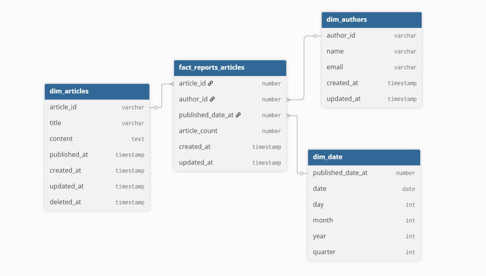
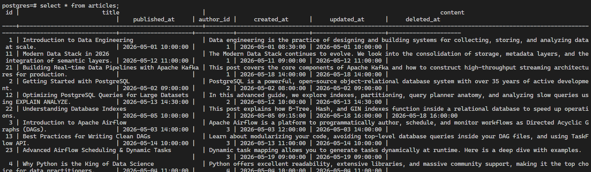
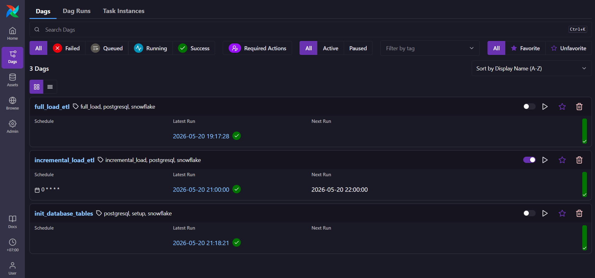
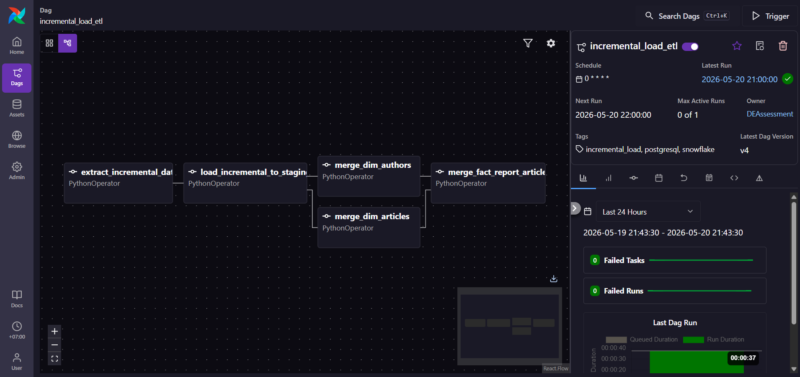
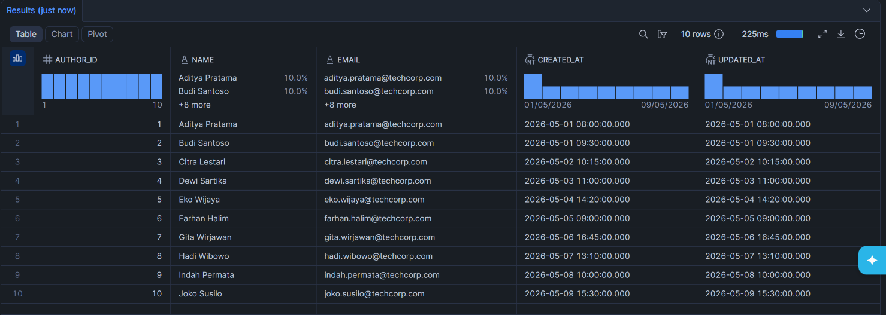
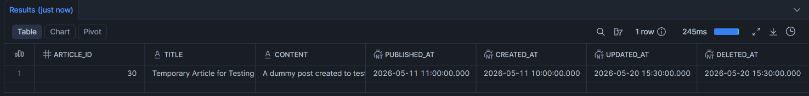
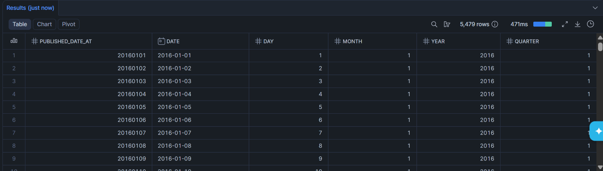
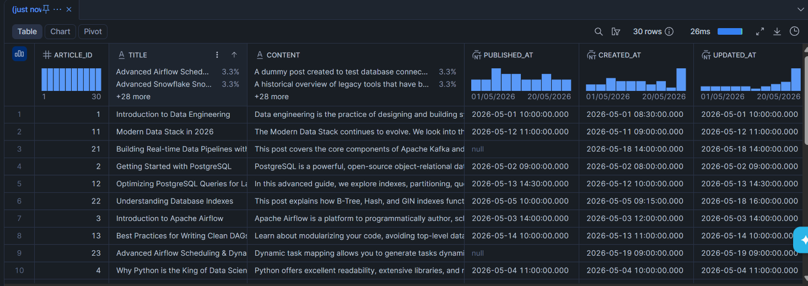
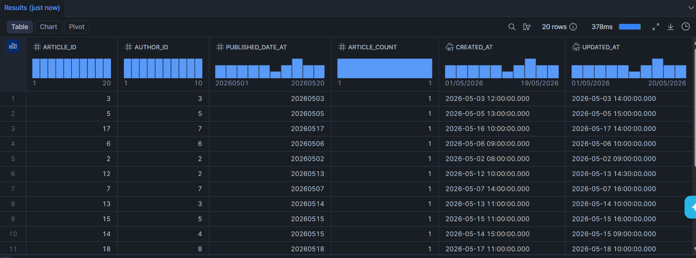

# Data Engineer Assessment - Kumparan

Project ini merupakan pipeline ETL/ELT yang dibangun menggunakan **Apache Airflow** (Astronomer Runtime) untuk memproses data dari database source **PostgreSQL** ke data warehouse **Snowflake**.

## Tech Stack

| Teknologi | Fungsi |
|---|---|
| **Apache Airflow** (Astronomer Runtime) | Orchestrator pipeline ETL/ELT |
| **PostgreSQL** | Database source (OLTP) |
| **Snowflake** | Data Warehouse target (OLAP) |
| **Python** | Bahasa pemrograman utama untuk DAG dan logic ETL |
| **Docker** | Containerization untuk environment Airflow lokal |
| **Pandas** | Library untuk manipulasi dan transformasi data |

## Struktur Project

```
Data_Engineer_Assessment-Kumparan/
├── dags/
│   ├── init_database_tables.py      # DAG inisialisasi tabel & seeding data
│   ├── full_load_etl.py             # DAG full load ETL
│   └── incremental_load_etl.py      # DAG incremental load ETL
├── include/
│   ├── source_table_creation.sql    # DDL tabel source PostgreSQL
│   ├── target_table_creation.sql    # DDL tabel target Snowflake
│   ├── dim_date_table_creation.sql  # DDL tabel dim_date untuk DWH
│   └── seed_data_source.sql         # Data dummy/seed untuk PostgreSQL
├── plugins/
├── tests/
├── .dockerignore
├── .env
├── .gitignore
├── Dockerfile
├── airflow_settings.yaml
├── packages.txt
├── requirements.txt
└── README.md
```

## Arsitektur Pipeline

### Skema Database

#### PostgreSQL (Source)
- **`authors`**: Tabel penulis artikel (`id`, `name`, `email`, `created_at`, `updated_at`)
- **`articles`**: Tabel artikel (`id`, `title`, `content`, `published_at`, `author_id`, `created_at`, `updated_at`, `deleted_at`)

> Tabel source dilengkapi dengan **trigger** untuk auto-update kolom `updated_at` dan **index** pada kolom `updated_at`, `published_at`, `deleted_at` untuk mendukung query incremental load.

#### Snowflake (Target)

**Schema `staging`** (Raw/Landing Zone):
- `staging.authors`
- `staging.articles`

**Schema `dwh`** (Data Warehouse):
- `dwh.dim_authors` — Dimensi penulis
- `dwh.dim_articles` — Dimensi artikel
- `dwh.dim_date` — Dimensi tanggal
- `dwh.fact_reports_articles` — Tabel fakta laporan artikel

### DAG Pipeline

#### 1. `init_database_tables` — Inisialisasi Database

DAG ini dijalankan **sekali** untuk menyiapkan seluruh infrastruktur database:

```
setup_source_postgres >> seed_source_postgres >> setup_target_snowflake
```

| Task | Deskripsi |
|---|---|
| `setup_source_postgres` | Membuat tabel, index, function, dan trigger di PostgreSQL |
| `seed_source_postgres` | Memasukkan data dummy ke tabel `authors` dan `articles` |
| `setup_target_snowflake` | Membuat schema dan tabel staging serta DWH di Snowflake |

#### 2. `full_load_etl` — Full Load

DAG ini melakukan **full load** (memuat seluruh data dari source ke target). Digunakan untuk kebutuhan **backfill** atau inisialisasi awal data warehouse.

```
extract_data_from_postgres >> load_data_to_staging >> [load_dim_authors, load_dim_articles] >> load_fact_report_articles
```

| Task | Deskripsi |
|---|---|
| `extract_data_from_postgres` | Mengekstrak seluruh data dari PostgreSQL ke file CSV |
| `load_data_to_staging` | Memuat file CSV ke staging tables Snowflake (PUT + COPY INTO) |
| `load_dim_authors` | Truncate & insert data ke `dwh.dim_authors` |
| `load_dim_articles` | Truncate & insert data ke `dwh.dim_articles` |
| `load_fact_report_articles` | Truncate & insert data ke `dwh.fact_reports_articles` |

> Task `load_dim_authors` dan `load_dim_articles` berjalan **secara paralel** untuk mengoptimalkan waktu eksekusi.

#### 3. `incremental_load_etl` — Incremental Load

DAG ini melakukan **incremental load** menggunakan strategi delta berdasarkan kolom `updated_at`. Hanya data yang baru atau berubah yang diproses, menggunakan perintah **MERGE (Upsert)** di Snowflake. Schedule yang digunakan yaitu perjam/hourly.

```
extract_incremental_data >> load_incremental_to_staging >> [merge_dim_authors, merge_dim_articles] >> merge_fact_report_articles
```

| Task | Deskripsi |
|---|---|
| `extract_incremental_data` | Mengekstrak data delta dari PostgreSQL (`WHERE updated_at >= threshold`) |
| `load_incremental_to_staging` | Memuat data delta ke staging tables Snowflake |
| `merge_dim_authors` | MERGE (Upsert) data ke `dwh.dim_authors` |
| `merge_dim_articles` | MERGE (Upsert) data ke `dwh.dim_articles` |
| `merge_fact_report_articles` | MERGE + DELETE data ke `dwh.fact_reports_articles` |

> Tabel fakta secara otomatis menghapus record untuk artikel yang berubah menjadi draft (`published_at IS NULL`) atau di-soft delete (`deleted_at IS NOT NULL`).

## Cara Menjalankan Project

### Prasyarat
- [Docker Desktop](https://www.docker.com/products/docker-desktop/) terinstal dan berjalan
- [Astronomer CLI](https://www.astronomer.io/docs/astro/cli/install-cli/) terinstal

### 1. Clone Repository

```bash
git clone <repository-url>
cd Data_Engineer_Assessment-Kumparan
```

### 2. Konfigurasi Koneksi

Sebelum menjalankan project, pastikan Anda telah mengkonfigurasi Airflow Connections melalui file `airflow_settings.yaml` atau melalui Airflow UI:

| Connection ID | Tipe | Deskripsi |
|---|---|---|
| `postgres_source` | Postgres | Koneksi ke database source PostgreSQL |
| `snowflake_target` | Snowflake | Koneksi ke data warehouse target Snowflake |

### 3. Jalankan Airflow

```bash
astro dev start
```

Perintah ini akan menjalankan lima Docker container:
- **Postgres** — Metadata Database Airflow
- **Scheduler** — Monitoring dan triggering task
- **DAG Processor** — Parsing file DAG
- **API Server** — Menyajikan Airflow UI dan API
- **Triggerer** — Menjalankan deferred tasks

Akses Airflow UI di: **http://localhost:8080**

### 4. Urutan Eksekusi DAG

1. Jalankan **`init_database_tables`** terlebih dahulu untuk membuat tabel dan memasukkan data seed
2. Jalankan **`full_load_etl`** untuk memuat data pertama kali ke Snowflake
3. Jalankan **`incremental_load_etl`** secara berkala untuk memuat data baru/berubah

### 5. Menghentikan Airflow

```bash
astro dev stop
```

## Dependencies

```
apache-airflow-providers-snowflake
apache-airflow-providers-postgres
pandas
```

## Bonus

### Data Warehouse Schema



## Pertanyaan

`The ETL/ELT that you made is new, and the data that is in the database is from 2016. What should you consider?`
Jawaban: Menurut saya, perlu mengetahui terlebih dahulu apakah data lama yang dari tahun 2016 masih berguna atau tidak. jika masih berguna, bisa menggunakan cara full load untuk memproses data tersebut. dikarenakan untuk melakukan full load dengan data dari tahun yang sudah lama akan memakan resource yang banyak, maka bisa menggunakan cara chuncking atau menggunakan spark untuk computasinya dan perlu resource server yang besar juga.

`What if the table design is using "hard delete" method. That means once the data is deleted, the row is also get deleted. So the data in the data warehouse and in the database should sync`
Jawaban: Menurut saya untuk solusi tersebut bisa menggunakan cara pertama melakukan comparasi kolom primary key dari table source dan target, dengan menghapus data pada table target. Kedua, bisa menggunakan cara CDC (Change Data Capture). Dan terakhir, bisa menggunakan full load secara berkala.

## Dokumentasi

### PostgreSQL database source



### Airflow UI dags





### Snowflake database target

#### Incremental load







#### Full load



